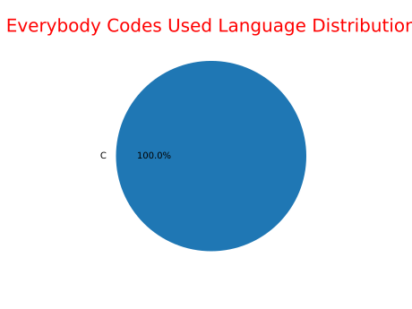

# Everybody Codes

This repository contains my solutions for the [Everybody Codes](https://everybody.codes) challenges.

## Language Distribution

`Important: The language distribution does not include the CMake and Make build systems languages`

## Languages

| Year | Languages |
|------|-----------|
| [`2024`](#2024)| [`C`](./2024/c/) |

## 2024

| Problems |
|----------|
| [`The Battle for the Farmlands`](https://everybody.codes/event/2024/quests/1)

### Solutions

| Languages | Days |
|-----------|------|
| [`C`](./2024/c/) | [`1`](./2024/c/1) |

# Language Support

| Language | Status |
|----------|--------|
| `C` | ✅ |